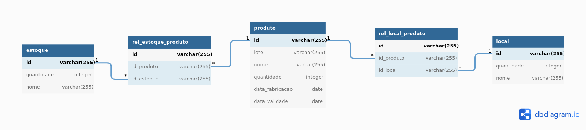
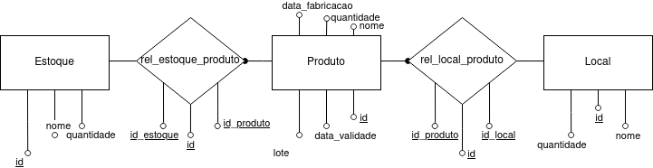

# Supermercado Documentação

## Descrição
Este repositório é responsável pela documentação do projeto.

O projeto em si tem o objetivo de controlar o fluxo de mercadorias, sendo desde a chegada no supermercado até a saída no caixa.

## Documentação
* [APIs](docs/APIs.yaml)
* [Arquitetura Sistêmica](diagramas/Arquitetura%20sistêmica.pdf)

* [Casos de uso](diagramas/Casos%20de%20uso.pdf)

* [DER](diagramas/DER.pdf)

* [Fluxograma](diagramas/Fluxograma.pdf)

* [MER](diagramas/MER.pdf)

* [MVC](diagramas/MVC.pdf)

* [Prototipação](UI-UX)

## Repositórios
* [Banco de dados](https://github.com/alcidesbeato/Redes-backend)
* [Aplicativo](https://github.com/RichardCLopes/QRCode_Reader)
* [Sistemas Web](https://github.com/alcidesbeato/Sistema-web-Almoxarifado)

## Autores
[Alcides Gomes Beato Neto](https://github.com/alcidesbeato)

[André Alves Pinto](https://github.com/1996aap)

[Derek Freire Quaresma](https://github.com/derekfq)

[Henrique Sartori Siqueira](https://github.com/h-ssiqueira)

[Rafael Silva Barbon](https://github.com/RafaelBarbon)

[Richard do Carmo Lopes](https://github.com/RichardCLopes)
